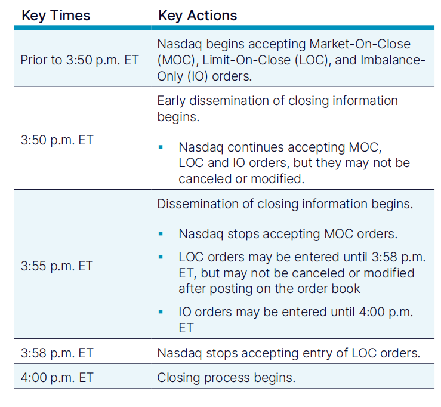

# closing_auction_premodel
 如果没有我们今天所讨论的closing auction，股票市场在收盘的时候可能会出现剧烈波动，这将带来严重的金融风险。为了应对这种风险，美国股市（讨论Nasdaq）引入了closing auction。closing auction的原理是在收盘前的最后10分钟，让买卖双方进行竞价，以确定收盘价。closing auction的成交量很大，将近10%的纳斯达克平均日交易量发生在收盘拍卖中。我们的研究在于通过预测未来60s的价格波动幅度来实现对于收盘价的间接预测，以便于做市商能够更好的提高流动性（**主要是做市商**），避免单边行情的出现。同时为个人交易者提供更优的报价策略。（这个部分查询资料继续补充我们研究的重要性，从闭市拍卖的重要性，收盘价预测的复杂性，预测准了带来的好处&比如提高做市商的做市效率增大流动性）

## 1. closing auction的crossing auction机制（结合订单簿来叙述）
closing auction的auction机制是一个特殊的交易过程，旨在确定收盘价。最后的十分钟，除了连续订单簿以外还有收盘订单簿。最后的收盘价格是在合并订单簿上通过closing cross确定的。在这个过程中，所有挂单（包括MOC、LOC和IO订单）被汇集在一起，以确定一个交易价格。这个价格是在保证最大成交量的同时，尽量缩小买卖双方报价的差距。在交易的最后阶段，交易所的系统会自动匹配这些订单，找到一个最优的交易价格点，这个价格成为当日的官方收盘价。在这个过程中，交易所的订单簿会暂时冻结（无法撮合），以便进行这种集中式的价格计算和匹配。

closing auction的重要性在于：

1. 市场稳定性： closing auction有助于减少收盘时的价格波动，为市场提供稳定性。
2. 价格发现： 通过集中竞价，closing auction促进了更有效的价格发现机制，确保收盘价反映了市场的真实供需关系。
3. 风险管理： 对于投资者而言，closing auction提供了一种在明确价格下进行交易的方式，有助于更好地管理价格风险。
4. 流动性： 因为大量交易集中在收盘时进行，closing auction有助于增加市场流动性，特别是对于那些通常交易量较低的股票。

## 2. closing auction的订单类型
- MOC (Market on Close)：收盘市价订单（MOC）只是计划在收盘时以最新交易价格进行交易的市价订单。MOC 订单在接近收盘前保持休眠状态，此时它会变得活跃。一旦 MOC 订单生效，它的行为就像正常的市价订单一样。MOC订单可以帮助投资者以收盘价进场或离场，而无需在收盘时立即下市价单。**它需要在15:45前提交, 并且在15:50后不能取消或者修改。**
- LOC (Limit on Close)：限价收盘订单（LOC）是指以限定价格或更好价格执行的订单。如果收盘价优于或等于限定价格，订单将被执行。LOC订单为投资者提供了更多控制权，允许他们设定期望的最低或最高价格。
- IO (Imbalance Only)：仅不平衡订单（IO）是特定于收盘拍卖的订单类型。这些订单仅在存在不平衡（即买单和卖单之间的数量差异）时才会执行。IO订单有助于调节市场不平衡，促进在收盘时更有效的价格发现过程。

## 3. closing auction的时间线
- 15:50:00之前：可以提交MOC, LOC, IO订单，并且可以修改或者取消
- 15:50:00 - 15:55:00：可以提交MOC, LOC, IO订单，但是不能修改或者取消。开始提供 Net Order Imbalance Indicator（NOII）数据：Number of Paired Shares， Imbalance Side，Imbalance Quantity，Current Reference Price
- 15:55:00 - 15:58:00：停止接受MOC，继续接受LOC, IO订单，但是不能修改或者取消。继续提供NOII数据，并且开始提供Near Indicative Clearing Price，Far Indicative Clearing Price
- 15:58:00 - 16:00:00：停止接受MOC, LOC，继续接受IO订单，但是不能修改或者取消

## 4. 竞赛数据详细说明（摘自https://www.kaggle.com/code/tomforbes/optiver-trading-at-the-close-introduction）

在这个Kaggle竞赛中，参赛者的任务是预测10分钟拍卖期间股票价格的短期走势。所有训练数据都包含在一个名为train.csv的文件中。更多信息和特定列的定义可参考官方网站 https://www.kaggle.com/competitions/optiver-trading-at-the-close/data 以及相关笔记本介绍。

以下是数据列的详细说明：

1. **`stock_id`（股票ID）** - 这是股票的唯一标识符。需要注意的是，并非所有股票ID在每个时间桶（时间段）都存在。

2. **`date_id`（日期ID）** - 日期的唯一标识符。日期ID是连续的，并且在所有股票中保持一致，以便于进行横向比较。

3. **`imbalance_size`（失衡大小）** - 指在当前参考价格下未能匹配的股票数量（以美元计）。这可以反映市场供需关系的紧张程度。

4. **`imbalance_buy_sell_flag`（买卖失衡标志）** - 这是一个指示拍卖失衡方向的标志，它包括：
    - 买方失衡（标记为1）
    - 卖方失衡（标记为-1）
    - 无失衡（标记为0）

5. **`reference_price`（参考价格）** - 合并订单簿的合意价格为最优bid ask中间的near price（如果near price超出 best bid或者best ask，则为near prcie），我们把它叫做`reference_price`。

6. **`matched_size`（匹配大小）** - 在当前参考价格下可以匹配的股票数量（以美元计）。

7. **`far_price`（远端价格）** - 收盘订单簿的最优交易价格。

8. **`near_price`（近端价格）** - 合并订单簿的最优交易价格。

9. **`[bid/ask]_price`（买入/卖出价格）** - 连续订单簿中最有竞争力的买入/卖出级别的价格。

10. **`[bid/ask]_size`（买入/卖出数量）** - 连续订单簿中最有竞争力的买入/卖出级别上的美元名义金额。

11. **`wap`（加权平均价格）** - 非拍卖账本中的加权平均价格，计算公式为 $$\frac{ {BidPrice \times AskSize + AskPrice \times BidSize}}{BidSize + AskSize} $$

12. **`seconds_in_bucket`（buccket秒数）** - 自当天收盘拍卖开始以来已经过的秒数，始终从0开始计算。

13. **`target`（目标值）** - 衡量股票的wap（加权平均价格）在未来60秒的变动幅度，减去合成指数在未来60秒的变动幅度。
    - 合成指数是Optiver为此竞赛构建的Nasdaq上市股票的自定义加权指数。
    - 目标值的单位是基点，这是金融市场中常用的计量单位。1基点的价格移动等同于0.01%的价格移动。
    - 目标值的计算公式为：$$ Target = (\frac{StockWAP_{t+60}}{StockWAP_{t}} - \frac{IndexWAP_{t+60}}{IndexWAP_{t}}) \times 10000 $$

**所有与大小相关的列的数值都以美元为单位。所有与价格相关的列的数值都转换为相对于拍卖期开始时股票wap（加权平均价格）的价格变动。**

> 参考
> 
> http://nasdaqtrader.com/Trader.aspx?id=OpenClose
> 
> https://www.nasdaqtrader.com/content/productsservices/Trading/ClosingCrossfaq.pdf
> 
> https://www.investopedia.com/terms/n/net-order-imbalance-indicator-noii.asp
> 
> https://www.investopedia.com/terms/i/imbalance-only-orders-io.asp